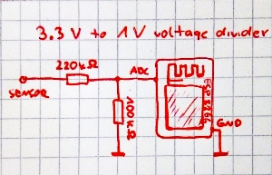

# sensors
Simple micropython libraries for various sensors

## distance.py

Simple library which used for **HC-SR04** ultrasonic distance sensor and **Sharp GP2Y0A21YK** (10-80cm range) infrared distance sensor.
Source file: [distance.py](distance.py)

**WARNING:**
The Sharp infrared distance sensor can return a voltage as high as 2.6V above the maximum allowable input voltage for the AD pin on the ESP8266 (1V). This applies to all separate modules like ESP-12, ESP-07 and similar that do not have a onboard resistor voltage divider at the AD input. In this case a resistor divider with values of 220kohm and 100kohm should be used.

___
```
class hcsr04
```
___
Initialise pins used by sensor
```
hcsr04.init(echo_pin, trig_pin)
```
parameters:
- **echo_pin** - sensor ECHO pin
- **trig_pin** - sensor TRIGGER pin
___
Read measured distance in centimeters from sensor 
```
hcsr04.distance_cm()
```
parameters: none
___
Read measured distance in meters from sensor 
```
hcsr04.distance_m()
```
parameters: none

___
class sharp1080
___
Initialise sensor pin and reading board type. In case of ESP8266 **pin** number may be any number. It has only one AD input pin 

```
sharp1080.init(pin, model)
```

Parameters:
- **pin** - number of pin connected to sensor.
- **model** - model type of board. Avialable values

**1** or **sharp1080.ESP8266** for esp 8266

**2** or **sharp1080.ESP32** for esp 32

**3** or **sharp1080.PICO** for Raspberry Pi Pico
___
Read measured distance in centimeters from sensor.
```
sharp1080.distance_cm()
```
Parameters: none
___
Read measured distance in meters from sensor.
```
sharp1080.distance_m()
```
Parameters: none
___
### example
```
# INFRARED SENSOR
# import library
from distance import sharp1080 as dist
# esp8266 case init
dist.init(0, dist.ESP8266)
# esp32 case init
dist.init(36, dist.ESP32)
# raspberry pi pico case init
dist.init(26, dist.PICO)
# read measured distance
print(dist.distance_cm())
```
___
```
# ULTRASONIC SENSOR
# import library
from distance import hcsr04 as dist
# init sensor
dist.init(4, 5)
# measure distance
print(dist.distance_m())
```


## dallas.py
A simple library to support the dallas **ds1820** and **ds18b20** temperature sensor. Only conversion and temperature reading for one sensor per pin is implemented. Communication with the sensor is done bypassing the sensor address.
Parasite power mode is not implemented.
Source file: [dallas.py](dallas.py)

### ds1820
Class for ds1820 temperature sensor with 9 bit resolution (temperature changes by 0.5°C).
___
```
class ds1820
```
___
Initialise and configure pins used by sensor.
```
dallas.ds1820.init(pin)
```
parameters:
- **pin** - sensor DQ pin
___
Send convert command to begin measure temperature
```
dallas.ds1820.convert(pin)
```
parameters:
- **pin** - sensor DQ pin
___
Send read command to read measurement temperature
```
dallas.ds1820.read(pin)
```
parameters:
- **pin** - sensor DQ pin
___

### ds18b20
Class for ds18b20 temperature sensor with 12 bit resolution (temperature changes by 0.0625°C).
___
```
class ds18b20
```
___
Initialise and configure pins used by sensor.
```
dallas.ds18b20.init(pin)
```
parameters:
- **pin** - sensor DQ pin
___
Send convert command to begin measure temperature
```
dallas.ds18b20.convert(pin)
```
parameters:
- **pin** - sensor DQ pin
___
Send read command to read measurement temperature
```
dallas.ds18b20.read(pin)
```
parameters:
- **pin** - sensor DQ pin
___

## example
```
# model ds18b20
import time
from dallas import ds18b20 as ds
ds.init(4)
ds.convert(4)
# wait 750ms to end of measure temperature
time.sleep(0.75)
print("temperature: " + str(ds.read(4)))
```
